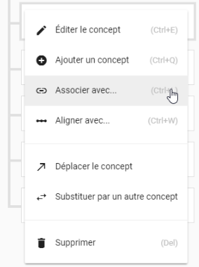

# Alimenter un thésaurus

## La thesauthèque

Koncept est notre solution de gestion de terminologies [SKOS](http://www.sparna.fr/skos/SKOS-traduction-francais.html) dont les concepts servent à indexer les ressources versées dans [Weever](https://mnemotix.gitbook.io/weever/).

Actuellement chaque thésaurus de la thesauthèque est proposé dans toutes les rubriques de Weever. 


Il sera possible dans le version 2 d'utiliser plusieurs thésaurus dans certaines parties de Weever pour indexer des éléments particuliers, ou tout le site.


## Présentation générale 

### Page d'accueil d'un thésaurus

Un thésaurus dans Koncept se présente assez simplement sous la forme de colonnes en cascade \(appelée aussi [_Miller columns_](https://en.wikipedia.org/wiki/Miller_columns)\), pour représenter un ou plusieurs domaines de connaissance de façon hiérarchique, allant du plus générique en partant de la première colonne de gauche au plus spécifique en allant vers la droite. Plus on ouvre de colonnes, plus on descend dans le détail d'une branche.

### Ajouter une première branche

Les branches colorées qui sont de premier niveau dans la hiérarchie du thésaurus sont des "[schémas de concepts](http://www.sparna.fr/skos/SKOS-traduction-francais.html#schemes)" \(`skos:ConceptScheme`\), c'est à dire une agrégation hiérarchisée de plusieurs concepts SKOS représentant un domaine de connaissance. La notion de **schéma de concept** est utile pour travailler avec des données d'une source inconnue ou externe au sein d'un thésaurus, et pour travailler avec des données qui décrivent deux \(ou plusieurs\) systèmes d'organisation des connaissances différents. 

La seconde colonne attachée à la branche colorée correspond à la liste des TopConcepts, donc concepts génériques, qui constituent cette branche.


Par ex dans le thésaurus de la mobilité, il est utile de définir une branche "disciplines scientifiques" qui regrouperait toutes les disciplines impliquées dans la R&D de ce secteur d'activité. Les TopConcepts peuvent être les champs disciplinaires majeurs, comme les sciences fondamentales \(mathématique, physique, mécanique des fluides\), les sciences et technologies informatiques, les sciences humaines et sociales. La troisième branche représentera le détail de chaque discipline.


Pour ajouter une nouvelle branche au thésaurus, il suffit de cliquer sur les trois petits points à gauche de chaque box pour faire apparaître un menu contextuel.


Il est à noter que tous les sous-menus des menus contextuels des box possèdent également un **raccourci clavier**, bien utile lorsque l'on a a manipulé très régulièrement Koncept.


L'ajout d'une branche demande simplement un titre et une description optionnelle, puis l'ajout d'un code couleur qui sera repris dans Weever pour faciliter le repérage des branches du thésaurus lors du processus d'indexation.

Il est possible de revenir sur la fenêtre de description de la branche en cliquant sur l'icône "crayon" dans la box de la branche : 

### Ajouter un TopConcept

Comme pour ajouter une branche, il suffit de cliquer sur les trois petits points pour ouvrir le menu contextuel \(ou faire Ctrl+Q en raccourci clavier\), en se plaçant sur la branche à renseigner : 

Il suffit de remplir le formulaire avec les TopConcepts décrivant le domaine de connaissance que représente la branche colorée \(donc le schéma de concept, pour reprendre les termes SKOS\) : 

### Ajouter un concept

L'enrichissement de la sous-branche en concepts peut se faire en deux temps : 

* d'abord ajouter les concepts à la chaîne pour gagner du temps,
* ensuite revenir sur chaque concept et éditer ce dernier pour renseigner sa fiche \(voir le paragraphe sur le [Menu d'un concept](https://mnemotix.gitbook.io/koncept/premiers-pas/alimenter-un-thesaurus#menu-dun-concept)\)

Concernant l'ajout de concept au niveau de la seconde colonne, c'est à dire des TopConcepts de la branche, le menu contextuel change \(le raccourci clavier étant toujours Ctrl+Q\) car on ajoute à ce niveau les concepts plus spécifiques \(soit _narrower_\) : 


Nous détaillons les autres éléments du menu dans le paragraphe sur [les relations sémantiques](https://mnemotix.gitbook.io/koncept/premiers-pas/alimenter-un-thesaurus#les-relations-semantiques) entre concepts


Un clic sur Ajouter un concept ouvre la fenêtre suivante, avec l'ajout du choix de type de relation, soit un concept plus spécifique \(d'où le choix de _narrower_\), soit un concept relié \(voir le paragraphe sur [les concepts reliés](https://mnemotix.gitbook.io/koncept/premiers-pas/alimenter-un-thesaurus#les-concepts-relies)\) : 


Le raccourci clavier est à ce stade très utile lorsqu'il faut ajouter plusieurs concepts à la chaîne dans une sous-branche. Il est possible de revenir dans un deuxième temps sur chaque concept, comme le décrit le paragraphe suivant.


## Menu d'un concept

Nous présentons ci-après les différentes métadonnées qu'il est recommandé de renseigner pour chaque concept \(en suivant toujours les recommandations de la [norme SKOS](http://www.sparna.fr/skos/SKOS-traduction-francais.html)\).

### Les labels du concept

Les labels \(ou termes\) servent à nommer le concept. Par exemple, tutoriel, tutorial, cursillo sont des étiquettes décrivant le même concept en français, anglais et espagnol respectivement.

Généralement, il faut remplir le label dit principal \(`skos:prefLabel`\) pour nommer le concept. Il peut aussi y avoir des variantes, dans ce cas, il faut aussi remplir les labels secondaires \(`skos:altLabel`\), par exemple, si le terme possède un acronyme, il est intéressant de mettre ce dernier en tant que label secondaire \(ex : Ressources Humaines pour le label principal et RH pour le label secondaire\). Enfin il est aussi possible que le concept possède une signification dite cachée \(`skos:hiddenLabel`\), c'est à dire propre à une communauté ou un contexte particulier.


Koncept gère pour l'instant le français, l'anglais et l'espagnol pour tous les types de labels SKOS.


### Les notes

Les notes permettent de documenter le concept \(optionnel mais conseillé pour fabriquer un thésaurus riche et optimisé sémantiquement\).

* **Note d'usage** \(`skos:scopeNote`\) donne des indications sur l'usage du concept
* **Définition** \(`skos:definition`\) est utile pour une explication approfondie sur le sens du concept
* **Exemple** \(`skos:example`\) demande des exemples d'utilisation du concept
* **Note historique** \(`skos:historyNote`\) décrit les changements significatifs concernant le sens ou la forme du concept
* **Note éditoriale** \(`skos:editorialNote`\) est utile pour l'administration, les TODOs ou les contraintes sur le concept
* **Note de changement** \(`skos:changeNote`\) est pour garder une trace de tous les changements liés au concept, lors de l'évolution du thésaurus dans le temps

### Les collections

SKOS permet de définir des regroupements significatifs ou «collections» de concepts \(`skos:collections`\). Les collections sont utiles dans les cas où plusieurs concepts partagent un aspect commun et qu'il devient pratique de les rassembler dans un même groupe. Cependant, regrouper des concepts dans une collection ne remplace pas des assertions sur la place des concepts dans le schéma conceptuel du thésaurus.


Les Collections de concepts SKOS répondent à deux cas d'usage : la séparation d'un thésaurus en sous-parties \(micro-thésaurus\), ou la gestion des "facettes" dans un thésaurus.


## Les relations sémantiques

Dans SKOS, les relations hiérarchiques entre les concepts sont exprimées par les prédicats `skos:broader` et `skos:narrower`. Ceux-ci correspondent aux relations classiques que l'on retrouve au sein d'un thésaurus: générique/spécifique \(BT/NT soit _Broader Term_ / _Narrower Term_\).

Pour ce qui concerne les relations non hiérarchiques, celles-ci expriment une notion de «proximité» entre des concepts \(sans être pour autant reliées hiérarchiquement\). Dans Koncept, nous utilisons la relation SKOS `skos:related` \(correspondant à la notion de terme associé, RT - _Related Term_, que l'on retrouve classiquement dans les thésaurus\).

### Les concepts reliés

Pour relier deux concepts dans le thésaurus, il faut ouvrir le menu contextuel du concept et sélectionner Associer avec \(Ctrl+L\) : 

Une fenêtre s'ouvre proposant la liste des concepts dans le thésaurus, le moteur de recherche facilite le processus avec une auto-complétion, dès l'écriture des premières lettres.

Lors qu'un concept a été relié à un autre, lorsqu'on revient à la visualisation générale du thésaurus en colonne, une petite box mentionne les relations sous le concept : 

Un clic sur la box des concepts associés ouvre à côté un sous-menu présentant la liste des concept reliés au concept sélectionné : 

### Alignement de concepts

Il est aussi possible d'établir des relations inter-thésaurus en utilisant la fonction Aligner avec \(Ctrl+W\), ce qui permet de faire des alignements de concepts entre différents thésaurus de la thesauthèque.

